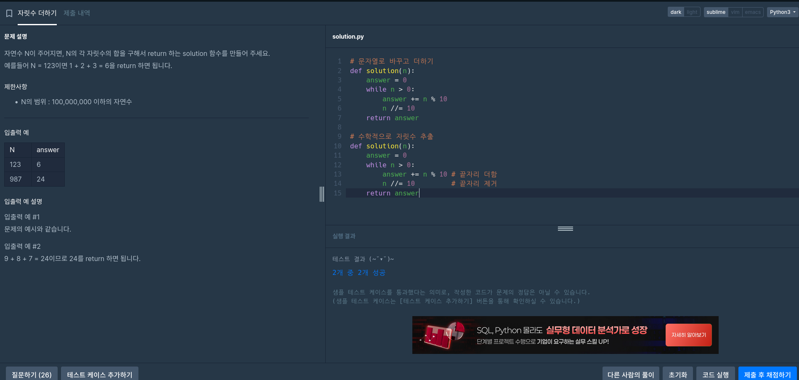
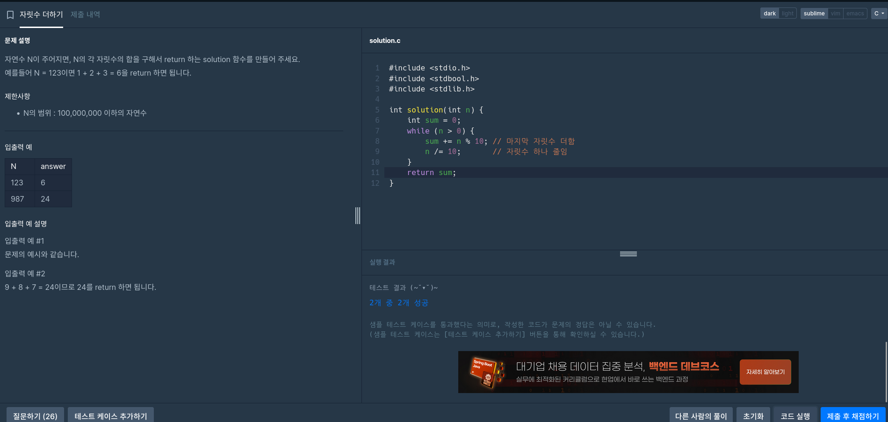
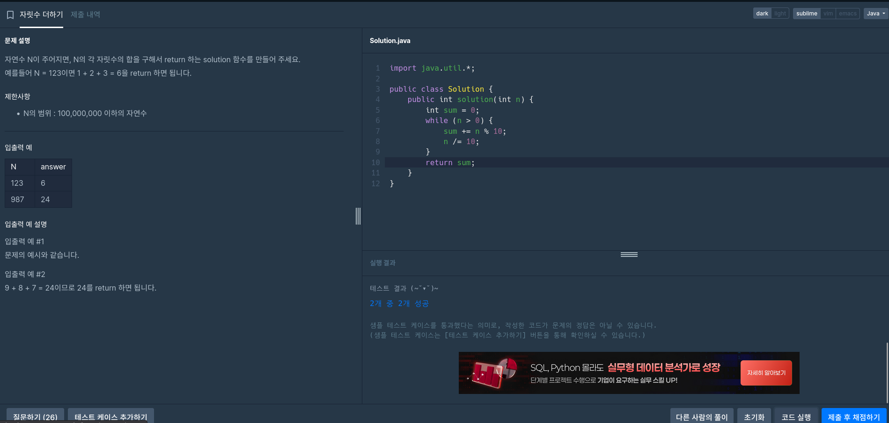
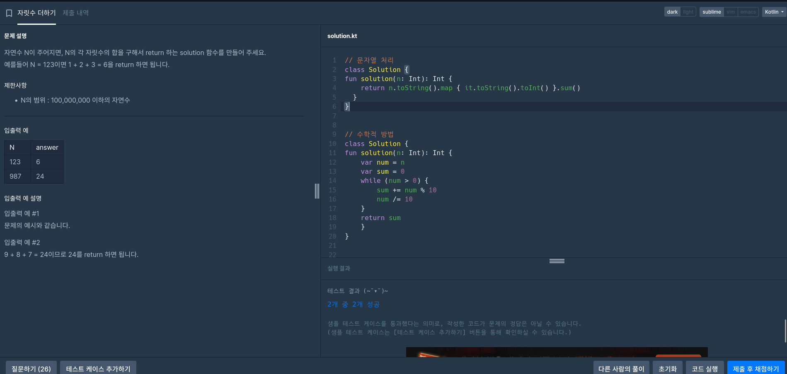

# 자리수 더하기 (SumOfDigits)

## 📈 문제 설명
자연수 `N`이 주어진면, `N`의 각 자리수의 합을 구해서 return 하는 `solution` 함수를 만들어 주세요.

### 예제
- N = 123 → 1 + 2 + 3 = 6
- N = 987 → 9 + 8 + 7 = 24

### 제한 사항
- N의 범위: 1 경우 ~ 100,000,000 이하의 자연수

### 입력 예시
| N   | answer |
|-----|--------|
| 123 | 6      |
| 987 | 24     |

---

## 🦍 Python

```python
# 수학적 방법
def solution(n):
    answer = 0
    while n > 0:
        answer += n % 10  # 가지 마지의 자리 더하기
        n //= 10          # 가지 마지 자리 제거
    return answer
```

```
# 문자열 처리
def solution(n):
    answer = 0
    for digit in str(n):
        answer += int(digit)
    return answer
---

## 🧱 C

```c
#include <stdio.h>
#include <stdbool.h>
#include <stdlib.h>

int solution(int n) {
    int sum = 0;
    while (n > 0) {
        sum += n % 10;  // 마지마지 자리 더하기
        n /= 10;        // 자리수 하나 제거
    }
    return sum;
}
```

---

## ☕ Java

```java
import java.util.*;

public class Solution {
    public int solution(int n) {
        int sum = 0;
        while (n > 0) {
            sum += n % 10;
            n /= 10;
        }
        return sum;
    }
}
```

---

## 🧊 Kotlin

```kotlin
// 문자열 처리
class Solution {
    fun solution(n: Int): Int {
        return n.toString().map { it.toString().toInt() }.sum()
    }
}

// 수학적 방법
class Solution {
    fun solution(n: Int): Int {
        var num = n
        var sum = 0
        while (num > 0) {
            sum += num % 10
            num /= 10
        }
        return sum
    }
}
```

---

## 📊 요조 비교표

| 언어    | 구현 방식         | 기본 방식       | 비고 |
|---------|----------------------|----------------------|------|
| Python  | while 메서드     | % 값 및 점체 발차     | 간단면 효과적 |
| C       | while 문           | % 및 /= 이용 계산     | 토정 중심 |
| Java    | while 문           | 같은 수학적 기능  | 필요 기술 포함 |
| Kotlin  | map 메서드 또는 while | 문자열 방식 또는 수학 | 2가지 가능 |

---

## 📸 실행 결과

- 
- 
- 
- 

