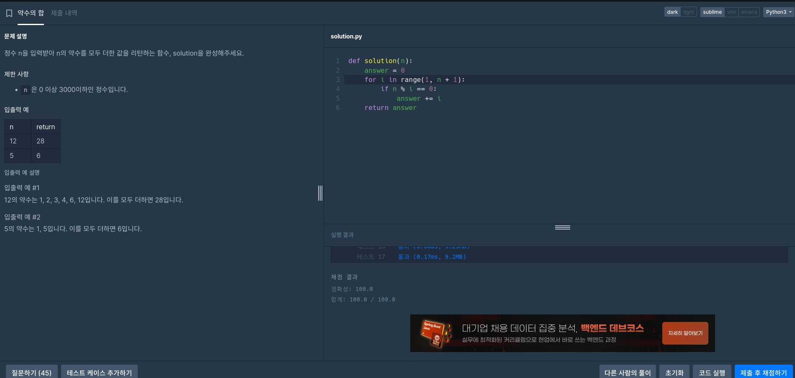
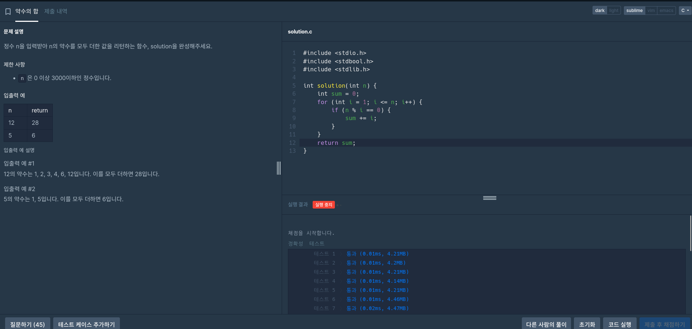
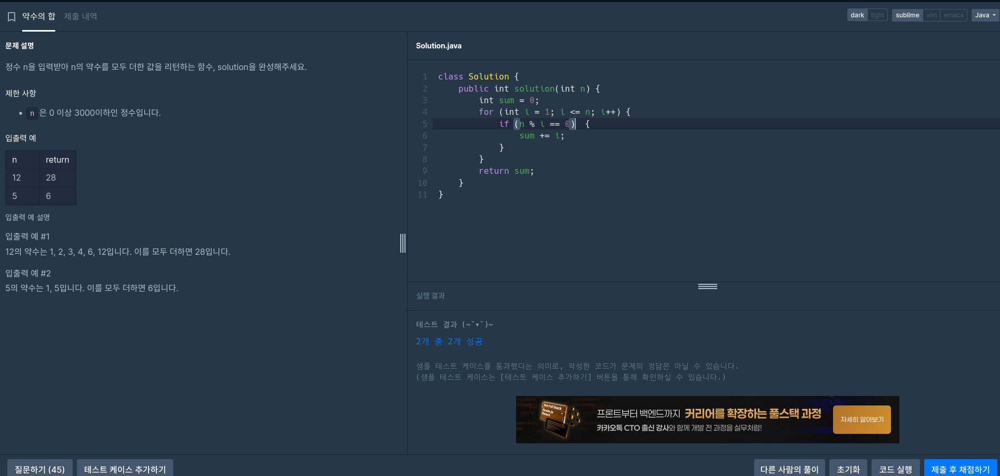
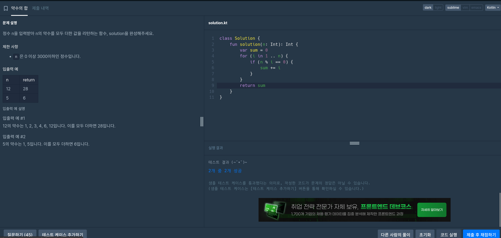

# 약수의 합 (SumOfDivisors)

## 📈 문제 설명
정수 `n`을 입력받아 `n`의 약수를 모두 더하는 값을 return하는 함수 `solution`을 구해보세요.

### 제한 사항
- `n` 은 0 이상 30,000이하의 정수입니다.

### 입력 예시
| n  | return |
|----|--------|
| 12 | 28     |
| 5  | 6      |

#### 설명
- 12의 약수: 1, 2, 3, 4, 6, 12 → 모두 더하면 28
- 5의 약수: 1, 5 → 모두 더하면 6

---

## 🦍 Python

```python
def solution(n):
    answer = 0
    for i in range(1, n + 1):
        if n % i == 0:
            answer += i
    return answer
```

---

## 🧱 C

```c
#include <stdio.h>
#include <stdbool.h>
#include <stdlib.h>

int solution(int n) {
    int sum = 0;
    for (int i = 1; i <= n; i++) {
        if (n % i == 0) {
            sum += i;
        }
    }
    return sum;
}
```

---

## ☕ Java

```java
class Solution {
    public int solution(int n) {
        int sum = 0;
        for (int i = 1; i <= n; i++) {
            if (n % i == 0) {
                sum += i;
            }
        }
        return sum;
    }
}
```

---

## 🧊 Kotlin

```kotlin
class Solution {
    fun solution(n: Int): Int {
        var sum = 0
        for (i in 1..n) {
            if (n % i == 0) {
                sum += i
            }
        }
        return sum
    }
}
```

---

## 📊 요조 비교표

| 언어    | 방식                | 보호문/메서드 | 특징 |
|---------|----------------------|------------------|--------|
| Python  | range(1, n+1)        | for + if         | 단순면 간단 |
| C       | for (i=1; i<=n; i++) | if (n % i == 0)  | 특수없이 계산 |
| Java    | for (i=1; i<=n; i++) | if (n % i == 0)  | 구조 같음 |
| Kotlin  | for (i in 1..n)      | if (n % i == 0)  | 간단 문법 |

---

## 📸 실행 결과

- 
- 
- 
- 

