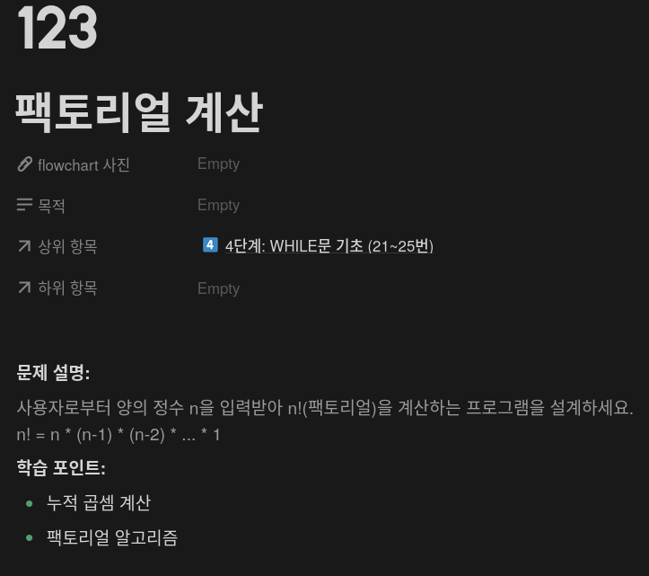
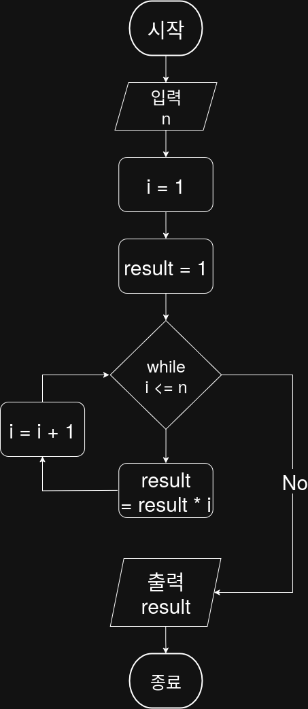

## 문제


## 정답


---

## Python3
```python
def solution(n):
    i = 1
    result = 1
    
    while n >= i:
        result *= i
        i += 1
    
    return result
```

## Java
```java
public class Main {
    public static int solution(int n) {
        int i = 1;
        int result = 1;

        while (i <= n) {
            result *= i;
            i++;
        }

        return result;
    }
```
