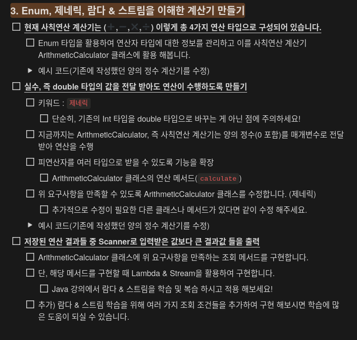

# 🧮 Java 계산기 프로젝트 (Lv3 - Enum, 제네릭, + 실전 CLI 확장)

이 프로젝트는 Java의 고급 문법을 활용하여 **계산기의 구조와 기능을 단계별로 확장**한 버전입니다.  
기존 Lv3(Class + Enum + Generic)에 더해, 실제 사용자 입력에 가까운 **실전 CLI 인터페이스(V3CLI)**를 구현했습니다.

---

## ✅ 구현 목표

---

## 📁 디렉토리 구성

| 디렉토리 / 파일 | 설명 |
|-----------------|------|
| `/Console/` | CLI 계산기 소스 (메인 실행 지점: `Main.java`) |
| `/Swing/` | GLI 계산기 소스 (메인 실행 지점: `CalculatorApp.java`) |
