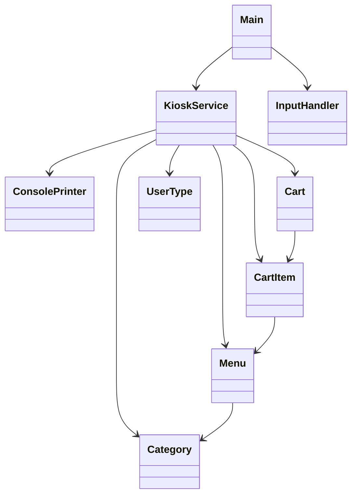

# ☕️ Java Kiosk
콘솔 기반 카페 키오스크 미니-프로젝트입니다.
UI·비즈니스 로직 분리, 예외 안전 입력, 패키지 계층 정비 등을 완료했습니다.

```
카테고리 → 메뉴 → (온도) → 수량 → 장바구니 → 결제/취소
```

---

## 📁 프로젝트 구조

```
src/
└─ kiosk
   ├─ model    ── Menu, CartItem, Cart, Category(enum), UserType(enum)
   ├─ service  ── KioskService  ← 비즈니스 로직
   ├─ ui       ── ConsolePrinter ← 모든 콘솔 출력·ANSI 스타일
   ├─ util     ── InputHandler   ← 안전 입력 유틸
   └─ Main.java ← 진입점 (사용자 이벤트 루프)
```

* **model**  – 순수 데이터·엔티티
* **service** – 메뉴·장바구니·결제 로직 (UI 모름)
* **ui**     – 콘솔 출력·색상·금액 포맷 (데이터 조작 없음)
* **util**   – 범용 유틸리티 (입력처리 등)

---

## 🔧 빌드 & 실행

```bash
# JDK 17+
javac -encoding UTF-8 -d out $(find src -name "*.java")
java  -cp out kiosk.Main
```

---

## 🧱 클래스 책임 요약

| 클래스                | 핵심 역할                                                                |
| ------------------ | -------------------------------------------------------------------- |
| **Main**           | 사용자 입력 루프·카테고리 분기·`KioskService` 호출                                  |
| **InputHandler**   | `Scanner` 기반 안전 입력(`getIntInput`, `getIntInRange`, `getStringInput`) |
| **KioskService**   | 메뉴 초기화, 장바구니·결제 로직, `ConsolePrinter` 호출로 UI 연결                       |
| **ConsolePrinter** | 카테고리/메뉴/장바구니/결제 요약 출력 + ANSI 스타일 상수 보관                               |
| **Cart**           | `addItem`, `removeOrDecrease`, `calculateTotal` 등 장바구니 상태 관리         |
| **CartItem**       | 메뉴-수량-온도 보관, `getSubtotal()` 로 개별 금액 계산                              |
| **UserType**       | `CAT`, `DOG`, `IDIOT` + 할인율, `fromInt()` 변환                          |
| **Category**       | `COFFEES`, `NON_COFFEES`, `DESSERTS` 메뉴 분류                           |

---

## 🔄 클래스 관계 다이어그램



---

## 🗺️ 다음 로드맵 아이디어

* **JUnit 5** 단위 테스트 (`Cart`, `InputHandler`)
* **Persistence** – JSON 기록 혹은 DB 연동으로 주문 내역 저장
* **Spring Boot MVC** – 서비스·모델 그대로 두고 웹 UI 레이어만 교체
* **다국어 출력** – `ConsolePrinter` 내 메시지 리소스 분리

