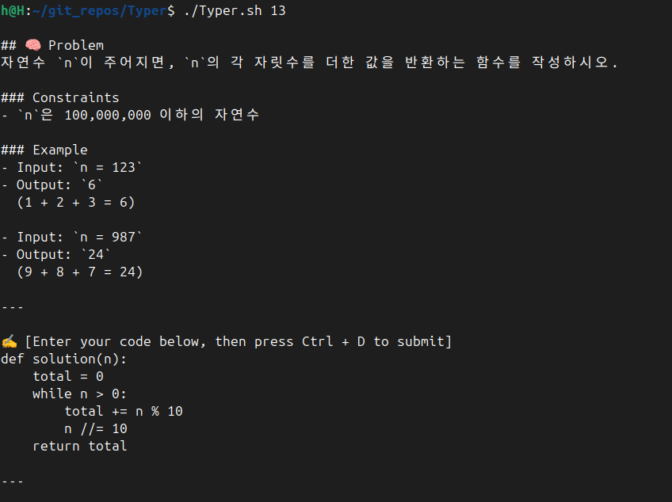
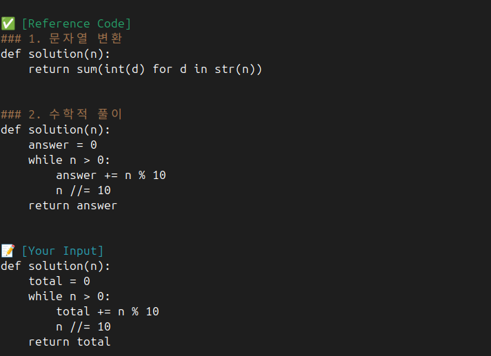
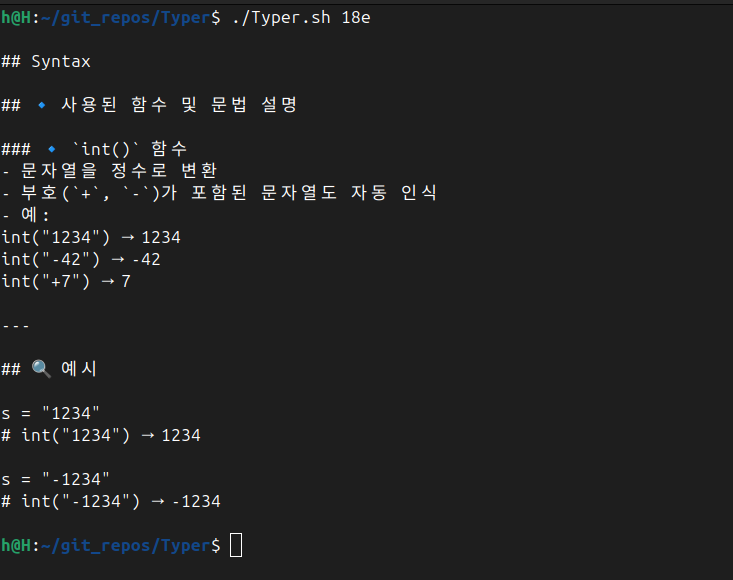

# 🧠 Python3 CLI Typer

Python3 기초 문법 문제를 반복 타이핑하며 학습하는 CLI 도구입니다. 
문제 설명과 코드 입력을 CLI 터미널에서 직접 보여주며, 
코딩 습관과 문법 기억을 동시에 훈련하는 것이 목적입니다.
이 자료에 포함된 모든 문제는 Programmers에 수록된 Python3 문제입니다.

---

## 📂 디렉토리 구조 예시

```
Typer/
│ ├── 01/
│ │ ├── Explanations.md
│ │ └── README.md
│ ├── ../
│ └── 50/
├── typer.sh
└── README.md
```

---

## 🚀 실행 화면



---



---



---

## ✅ 목적

- Python 문법을 반복 입력을 통해 자연스럽게 습득
- CLI 중심 학습 루틴 수립

---

## 💡 Tip

- typer.sh는 문제 폴더들의 상위 디렉토리에 위치해야 합니다.
- Linux / WSL 환경에서 사용을 권장합니다.


